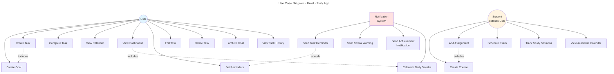
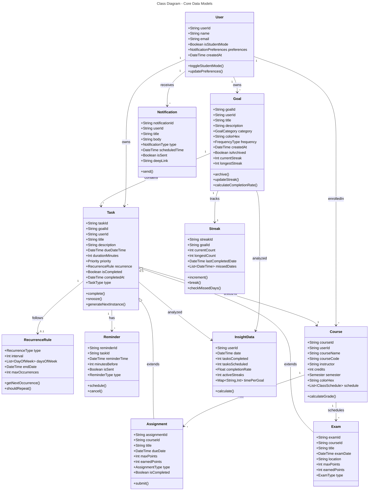
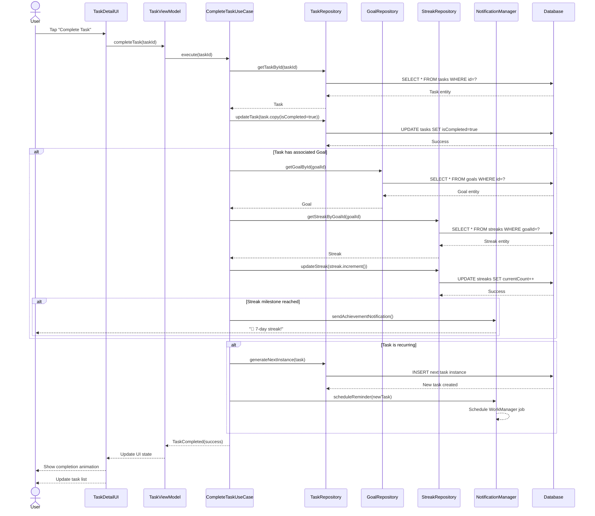
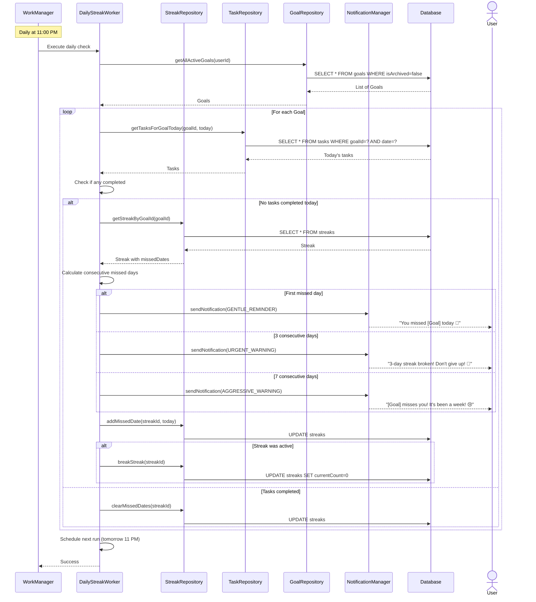
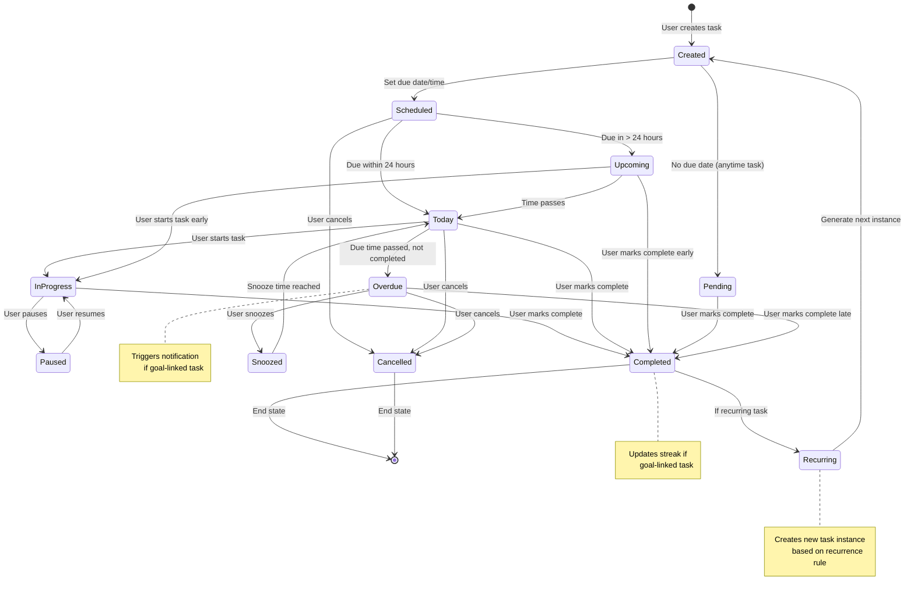
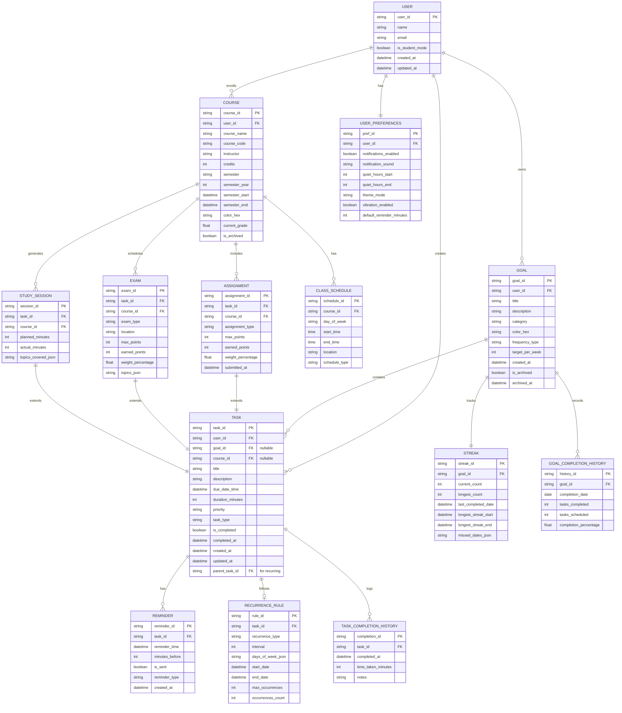
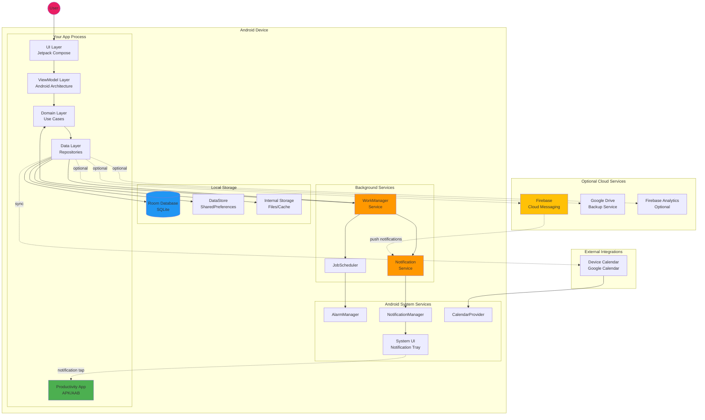

# Use Case diagram

# Class Diagram

# task completion flow sequence diagram

# Streak warning system sequence diagram

# task lifecycle state diagram

# create task workflow activity diagram

```mermaid
graph TD

    Start([User taps Create Task]) --> CheckMode{Student Mode<br/>Enabled?}

    CheckMode -->|Yes| SelectType[Select Task Type:<br/>- Free Task<br/>- Goal Task<br/>- Assignment<br/>- Study Session]

    CheckMode -->|No| SelectTypeBasic[Select Task Type:<br/>- Free Task<br/>- Goal Task]

    SelectType --> IsAssignment{Assignment<br/>Selected?}

    SelectTypeBasic --> IsGoalTask{Goal Task<br/>Selected?}

    IsAssignment -->|Yes| SelectCourse[Select Course]

    IsAssignment -->|No| IsStudySession{Study Session<br/>Selected?}

    IsStudySession -->|Yes| SelectCourse

    IsStudySession -->|No| IsGoalTask

    SelectCourse --> EnterAssignmentDetails[Enter Assignment Details:<br/>- Title<br/>- Due Date<br/>- Points]

    IsGoalTask -->|Yes| SelectGoal{Goal<br/>Exists?}

    IsGoalTask -->|No| EnterBasicDetails

    SelectGoal -->|Yes| ChooseGoal[Choose from Goal List]

    SelectGoal -->|No| CreateGoal[Create New Goal]

    CreateGoal --> EnterGoalDetails[Enter Goal Details:<br/>- Title<br/>- Category<br/>- Frequency<br/>- Color]

    EnterGoalDetails --> SaveGoal[Save Goal]

    SaveGoal --> ChooseGoal

    ChooseGoal --> EnterTaskDetails[Enter Task Details:<br/>- Title<br/>- Description]

    EnterAssignmentDetails --> EnterTaskDetails

    EnterBasicDetails[Enter Task Details:<br/>- Title<br/>- Description] --> EnterTaskDetails

    EnterTaskDetails --> SetSchedule[Set Schedule:<br/>- Due Date<br/>- Time<br/>- Duration]

    SetSchedule --> IsRecurring{Recurring<br/>Task?}

    IsRecurring -->|Yes| SetRecurrence[Set Recurrence:<br/>- Frequency<br/>- Days<br/>- End Date]

    IsRecurring -->|No| SetReminder

    SetRecurrence --> SetReminder{Add<br/>Reminder?}

    SetReminder -->|Yes| ConfigureReminder[Configure Reminder:<br/>- Time Before<br/>- Notification Type]

    SetReminder -->|No| SetPriority

    ConfigureReminder --> SetPriority[Set Priority:<br/>- Low<br/>- Medium<br/>- High<br/>- Urgent]

    SetPriority --> ReviewTask[Review Task Summary]

    ReviewTask --> ValidateInput{All Required<br/>Fields Valid?}

    ValidateInput -->|No| ShowError[Show Validation Errors]

    ShowError --> EnterTaskDetails

    ValidateInput -->|Yes| SaveTask[Save Task to Database]

    SaveTask --> ScheduleNotifications{Has<br/>Reminders?}

    ScheduleNotifications -->|Yes| CreateWorkManager[Schedule WorkManager Jobs<br/>for Notifications]

    ScheduleNotifications -->|No| CheckRecurringSchedule

    CreateWorkManager --> CheckRecurringSchedule{Is<br/>Recurring?}

    CheckRecurringSchedule -->|Yes| GenerateInstances[Generate Next<br/>Task Instance]

    CheckRecurringSchedule -->|No| UpdateUI

    GenerateInstances --> UpdateUI[Update Calendar<br/>and Task List UI]

    UpdateUI --> ShowSuccess[Show Success Message]

    ShowSuccess --> End([Task Created])

    style Start fill:#e1f5ff

    style End fill:#c8e6c9

    style ShowError fill:#ffcdd2

    style SaveTask fill:#fff9c4

    style CreateWorkManager fill:#fff9c4

    style GenerateInstances fill:#fff9c4
```

# android architecture component diagram

```mermaid
graph TB

    subgraph "Presentation Layer"

        A1[Home/Dashboard<br/>Screen]

        A2[Goals<br/>Screen]

        A3[Tasks<br/>Screen]

        A4[Calendar<br/>Screen]

        A5[Student Hub<br/>Screen]

        A6[Settings<br/>Screen]

        VM1[DashboardViewModel]

        VM2[GoalsViewModel]

        VM3[TasksViewModel]

        VM4[CalendarViewModel]

        VM5[StudentViewModel]

        VM6[SettingsViewModel]

    end

    subgraph "Domain Layer"

        UC1[CreateGoalUseCase]

        UC2[UpdateGoalUseCase]

        UC3[CreateTaskUseCase]

        UC4[CompleteTaskUseCase]

        UC5[CalculateStreakUseCase]

        UC6[GenerateInsightsUseCase]

        UC7[ScheduleReminderUseCase]

        UC8[CheckMissedGoalsUseCase]

        UC9[CreateCourseUseCase]

        UC10[SyncCalendarUseCase]

    end

    subgraph "Data Layer"

        R1[GoalRepository]

        R2[TaskRepository]

        R3[UserRepository]

        R4[NotificationRepository]

        R5[StudentRepository]

        R6[InsightsRepository]

        DS1[GoalLocalDataSource]

        DS2[TaskLocalDataSource]

        DS3[UserPreferencesDataSource]

        DS4[StudentLocalDataSource]

    end

    subgraph "Local Storage"

        DB[(Room Database)]

        PREFS[DataStore<br/>Preferences]

    end

    subgraph "Android Framework"

        WM[WorkManager]

        NM[NotificationManager]

        AM[AlarmManager]

        CAL[CalendarProvider]

    end

    subgraph "Background Workers"

        W1[DailyStreakCheckWorker]

        W2[ReminderWorker]

        W3[DataSyncWorker]

    end

    A1 --> VM1

    A2 --> VM2

    A3 --> VM3

    A4 --> VM4

    A5 --> VM5

    A6 --> VM6

    VM1 --> UC6

    VM1 --> UC5

    VM2 --> UC1

    VM2 --> UC2

    VM3 --> UC3

    VM3 --> UC4

    VM4 --> UC10

    VM5 --> UC9

    UC1 --> R1

    UC2 --> R1

    UC3 --> R2

    UC4 --> R2

    UC4 --> R1

    UC5 --> R1

    UC6 --> R6

    UC7 --> R4

    UC8 --> R1

    UC8 --> R2

    UC9 --> R5

    UC10 --> R2

    R1 --> DS1

    R2 --> DS2

    R3 --> DS3

    R4 --> WM

    R5 --> DS4

    DS1 --> DB

    DS2 --> DB

    DS3 --> PREFS

    DS4 --> DB

    R4 --> NM

    UC7 --> WM

    UC10 --> CAL

    WM --> W1

    WM --> W2

    WM --> W3

    W1 --> UC8

    W2 --> NM

    W3 --> R2

    style A1 fill:#e1f5ff

    style A2 fill:#e1f5ff

    style A3 fill:#e1f5ff

    style A4 fill:#e1f5ff

    style A5 fill:#e1f5ff

    style A6 fill:#e1f5ff

    style UC1 fill:#fff9c4

    style UC2 fill:#fff9c4

    style UC3 fill:#fff9c4

    style UC4 fill:#fff9c4

    style UC5 fill:#fff9c4

    style UC6 fill:#fff9c4

    style UC7 fill:#fff9c4

    style UC8 fill:#fff9c4

    style UC9 fill:#fff9c4

    style UC10 fill:#fff9c4

    style DB fill:#c8e6c9

    style PREFS fill:#c8e6c9
```

# entity relationship diagram

# deployment diagram

