# Use Case diagram

```mermaid
---

title: Use Case Diagram - Productivity App

---

graph TB

    User((User))

    Student((Student<br/>extends User))

    System[Notification<br/>System]

    User --> UC1[Create Goal]

    User --> UC2[Create Task]

    User --> UC3[Complete Task]

    User --> UC4[View Calendar]

    User --> UC5[View Dashboard]

    User --> UC6[Set Reminders]

    User --> UC7[Edit Task]

    User --> UC8[Delete Task]

    User --> UC9[Archive Goal]

    User --> UC10[View Task History]

    Student --> UC11[Create Course]

    Student --> UC12[Add Assignment]

    Student --> UC13[Schedule Exam]

    Student --> UC14[Track Study Sessions]

    Student --> UC15[View Academic Calendar]

    System --> UC16[Send Task Reminder]

    System --> UC17[Send Streak Warning]

    System --> UC18[Send Achievement<br/>Notification]

    System --> UC19[Calculate Daily Streaks]

    UC2 -.includes.-> UC1

    UC12 -.includes.-> UC11

    UC5 -.includes.-> UC19

    UC16 -.extends.-> UC6

    style User fill:#e1f5ff

    style Student fill:#fff4e1

    style System fill:#ffe1e1
```


# Class Diagram


```mermaid
---

title: Class Diagram - Core Data Models

---

classDiagram

    class User {

        +String userId

        +String name

        +String email

        +Boolean isStudentMode

        +NotificationPreferences preferences

        +DateTime createdAt

        +toggleStudentMode()

        +updatePreferences()

    }

    class Goal {

        +String goalId

        +String userId

        +String title

        +String description

        +GoalCategory category

        +String colorHex

        +FrequencyType frequency

        +DateTime createdAt

        +Boolean isArchived

        +Int currentStreak

        +Int longestStreak

        +archive()

        +updateStreak()

        +calculateCompletionRate()

    }

    class Task {

        +String taskId

        +String goalId

        +String userId

        +String title

        +String description

        +DateTime dueDateTime

        +Int durationMinutes

        +Priority priority

        +RecurrenceRule recurrence

        +Boolean isCompleted

        +DateTime completedAt

        +TaskType type

        +complete()

        +snooze()

        +generateNextInstance()

    }

    class RecurrenceRule {

        +RecurrenceType type

        +Int interval

        +List~DayOfWeek~ daysOfWeek

        +DateTime endDate

        +Int maxOccurrences

        +getNextOccurrence()

        +shouldRepeat()

    }

    class Reminder {

        +String reminderId

        +String taskId

        +DateTime reminderTime

        +Int minutesBefore

        +Boolean isSent

        +ReminderType type

        +schedule()

        +cancel()

    }

    class Course {

        +String courseId

        +String userId

        +String courseName

        +String courseCode

        +String instructor

        +Int credits

        +Semester semester

        +String colorHex

        +List~ClassSchedule~ schedule

        +calculateGrade()

    }

    class Assignment {

        +String assignmentId

        +String courseId

        +String title

        +DateTime dueDate

        +Int maxPoints

        +Int earnedPoints

        +AssignmentType type

        +Boolean isCompleted

        +submit()

    }

    class Exam {

        +String examId

        +String courseId

        +String title

        +DateTime examDate

        +String location

        +Int maxPoints

        +Int earnedPoints

        +ExamType type

    }

    class Streak {

        +String streakId

        +String goalId

        +Int currentCount

        +Int longestCount

        +DateTime lastCompletedDate

        +List~DateTime~ missedDates

        +increment()

        +break()

        +checkMissedDays()

    }

    class Notification {

        +String notificationId

        +String userId

        +String title

        +String body

        +NotificationType type

        +DateTime scheduledTime

        +Boolean isSent

        +String deepLink

        +send()

    }

    class InsightData {

        +String userId

        +DateTime date

        +Int tasksCompleted

        +Int tasksScheduled

        +Float completionRate

        +Int activeStreaks

        +Map~String,Int~ timePerGoal

        +calculate()

    }

    User "1" --> "*" Goal : owns

    User "1" --> "*" Task : owns

    User "1" --> "*" Course : enrolledIn

    User "1" --> "*" Notification : receives

    Goal "1" --> "*" Task : contains

    Goal "1" --> "1" Streak : tracks

    Task "1" --> "0..1" RecurrenceRule : follows

    Task "1" --> "*" Reminder : has

    Task "0..1" --> "1" Course : linkedTo

    Course "1" --> "*" Assignment : has

    Course "1" --> "*" Exam : schedules

    Assignment --|> Task : extends

    Exam --|> Task : extends

    Goal --> InsightData : analyzed

    Task --> InsightData : analyzed
```


# task completion flow sequence diagram


```mermaid
sequenceDiagram

    actor User

    participant UI as TaskDetailUI

    participant VM as TaskViewModel

    participant UC as CompleteTaskUseCase

    participant TR as TaskRepository

    participant GR as GoalRepository

    participant SR as StreakRepository

    participant NM as NotificationManager

    participant DB as Database

    User->>UI: Tap "Complete Task"

    UI->>VM: completeTask(taskId)

    VM->>UC: execute(taskId)

    UC->>TR: getTaskById(taskId)

    TR->>DB: SELECT * FROM tasks WHERE id=?

    DB-->>TR: Task entity

    TR-->>UC: Task

    UC->>TR: updateTask(task.copy(isCompleted=true))

    TR->>DB: UPDATE tasks SET isCompleted=true

    DB-->>TR: Success

    alt Task has associated Goal

        UC->>GR: getGoalById(goalId)

        GR->>DB: SELECT * FROM goals WHERE id=?

        DB-->>GR: Goal entity

        GR-->>UC: Goal

        UC->>SR: getStreakByGoalId(goalId)

        SR->>DB: SELECT * FROM streaks WHERE goalId=?

        DB-->>SR: Streak entity

        SR-->>UC: Streak

        UC->>SR: updateStreak(streak.increment())

        SR->>DB: UPDATE streaks SET currentCount++

        DB-->>SR: Success

        alt Streak milestone reached

            UC->>NM: sendAchievementNotification()

            NM-->>User: "🎉 7-day streak!"

        end

    end

    alt Task is recurring

        UC->>TR: generateNextInstance(task)

        TR->>DB: INSERT next task instance

        DB-->>TR: New task created

        UC->>NM: scheduleReminder(newTask)

        NM-->>NM: Schedule WorkManager job

    end

    UC-->>VM: TaskCompleted(success)

    VM-->>UI: Update UI state

    UI-->>User: Show completion animation

    UI-->>User: Update task list
```


# Streak warning system sequence diagram


```mermaid
sequenceDiagram

    participant WM as WorkManager

    participant Worker as DailyStreakWorker

    participant SR as StreakRepository

    participant TR as TaskRepository

    participant GR as GoalRepository

    participant NM as NotificationManager

    participant DB as Database

    actor User

    Note over WM: Daily at 11:00 PM

    WM->>Worker: Execute daily check

    Worker->>GR: getAllActiveGoals(userId)

    GR->>DB: SELECT * FROM goals WHERE isArchived=false

    DB-->>GR: List of Goals

    GR-->>Worker: Goals

    loop For each Goal

        Worker->>TR: getTasksForGoalToday(goalId, today)

        TR->>DB: SELECT * FROM tasks WHERE goalId=? AND date=?

        DB-->>TR: Today's tasks

        TR-->>Worker: Tasks

        Worker->>Worker: Check if any completed

        alt No tasks completed today

            Worker->>SR: getStreakByGoalId(goalId)

            SR->>DB: SELECT * FROM streaks

            DB-->>SR: Streak

            SR-->>Worker: Streak with missedDates

            Worker->>Worker: Calculate consecutive missed days

            alt First missed day

                Worker->>NM: sendNotification(GENTLE_REMINDER)

                NM-->>User: "You missed [Goal] today 🤔"

            else 3 consecutive days

                Worker->>NM: sendNotification(URGENT_WARNING)

                NM-->>User: "3-day streak broken! Don't give up! 💪"

            else 7 consecutive days

                Worker->>NM: sendNotification(AGGRESSIVE_WARNING)

                NM-->>User: "[Goal] misses you! It's been a week! 😢"

            end

            Worker->>SR: addMissedDate(streakId, today)

            SR->>DB: UPDATE streaks

            alt Streak was active

                Worker->>SR: breakStreak(streakId)

                SR->>DB: UPDATE streaks SET currentCount=0

            end

        else Tasks completed

            Worker->>SR: clearMissedDates(streakId)

            SR->>DB: UPDATE streaks

        end

    end

    Worker->>Worker: Schedule next run (tomorrow 11 PM)

    Worker-->>WM: Success
```


# task lifecycle state diagram


```mermaid
stateDiagram-v2

    [*] --> Created: User creates task

    Created --> Scheduled: Set due date/time

    Created --> Pending: No due date (anytime task)

    Scheduled --> Upcoming: Due in > 24 hours

    Scheduled --> Today: Due within 24 hours

    Upcoming --> Today: Time passes

    Today --> Overdue: Due time passed, not completed

    Today --> InProgress: User starts task

    Upcoming --> InProgress: User starts task early

    InProgress --> Paused: User pauses

    Paused --> InProgress: User resumes

    InProgress --> Completed: User marks complete

    Today --> Completed: User marks complete

    Upcoming --> Completed: User marks complete early

    Pending --> Completed: User marks complete

    Overdue --> Completed: User marks complete late

    Overdue --> Snoozed: User snoozes

    Snoozed --> Today: Snooze time reached

    Scheduled --> Cancelled: User cancels

    Today --> Cancelled: User cancels

    Overdue --> Cancelled: User cancels

    Completed --> [*]: End state

    Cancelled --> [*]: End state

    Completed --> Recurring: If recurring task

    Recurring --> Created: Generate next instance

    note right of Overdue

        Triggers notification

        if goal-linked task

    end note

    note right of Completed

        Updates streak if

        goal-linked task

    end note

    note right of Recurring

        Creates new task instance

        based on recurrence rule

    end note
```


# create task workflow activity diagram


```mermaid
graph TD

    Start([User taps Create Task]) --> CheckMode{Student Mode<br/>Enabled?}

    CheckMode -->|Yes| SelectType[Select Task Type:<br/>- Free Task<br/>- Goal Task<br/>- Assignment<br/>- Study Session]

    CheckMode -->|No| SelectTypeBasic[Select Task Type:<br/>- Free Task<br/>- Goal Task]

    SelectType --> IsAssignment{Assignment<br/>Selected?}

    SelectTypeBasic --> IsGoalTask{Goal Task<br/>Selected?}

    IsAssignment -->|Yes| SelectCourse[Select Course]

    IsAssignment -->|No| IsStudySession{Study Session<br/>Selected?}

    IsStudySession -->|Yes| SelectCourse

    IsStudySession -->|No| IsGoalTask

    SelectCourse --> EnterAssignmentDetails[Enter Assignment Details:<br/>- Title<br/>- Due Date<br/>- Points]

    IsGoalTask -->|Yes| SelectGoal{Goal<br/>Exists?}

    IsGoalTask -->|No| EnterBasicDetails

    SelectGoal -->|Yes| ChooseGoal[Choose from Goal List]

    SelectGoal -->|No| CreateGoal[Create New Goal]

    CreateGoal --> EnterGoalDetails[Enter Goal Details:<br/>- Title<br/>- Category<br/>- Frequency<br/>- Color]

    EnterGoalDetails --> SaveGoal[Save Goal]

    SaveGoal --> ChooseGoal

    ChooseGoal --> EnterTaskDetails[Enter Task Details:<br/>- Title<br/>- Description]

    EnterAssignmentDetails --> EnterTaskDetails

    EnterBasicDetails[Enter Task Details:<br/>- Title<br/>- Description] --> EnterTaskDetails

    EnterTaskDetails --> SetSchedule[Set Schedule:<br/>- Due Date<br/>- Time<br/>- Duration]

    SetSchedule --> IsRecurring{Recurring<br/>Task?}

    IsRecurring -->|Yes| SetRecurrence[Set Recurrence:<br/>- Frequency<br/>- Days<br/>- End Date]

    IsRecurring -->|No| SetReminder

    SetRecurrence --> SetReminder{Add<br/>Reminder?}

    SetReminder -->|Yes| ConfigureReminder[Configure Reminder:<br/>- Time Before<br/>- Notification Type]

    SetReminder -->|No| SetPriority

    ConfigureReminder --> SetPriority[Set Priority:<br/>- Low<br/>- Medium<br/>- High<br/>- Urgent]

    SetPriority --> ReviewTask[Review Task Summary]

    ReviewTask --> ValidateInput{All Required<br/>Fields Valid?}

    ValidateInput -->|No| ShowError[Show Validation Errors]

    ShowError --> EnterTaskDetails

    ValidateInput -->|Yes| SaveTask[Save Task to Database]

    SaveTask --> ScheduleNotifications{Has<br/>Reminders?}

    ScheduleNotifications -->|Yes| CreateWorkManager[Schedule WorkManager Jobs<br/>for Notifications]

    ScheduleNotifications -->|No| CheckRecurringSchedule

    CreateWorkManager --> CheckRecurringSchedule{Is<br/>Recurring?}

    CheckRecurringSchedule -->|Yes| GenerateInstances[Generate Next<br/>Task Instance]

    CheckRecurringSchedule -->|No| UpdateUI

    GenerateInstances --> UpdateUI[Update Calendar<br/>and Task List UI]

    UpdateUI --> ShowSuccess[Show Success Message]

    ShowSuccess --> End([Task Created])

    style Start fill:#e1f5ff

    style End fill:#c8e6c9

    style ShowError fill:#ffcdd2

    style SaveTask fill:#fff9c4

    style CreateWorkManager fill:#fff9c4

    style GenerateInstances fill:#fff9c4
```


# android architecture component diagram


```mermaid
graph TB

    subgraph "Presentation Layer"

        A1[Home/Dashboard<br/>Screen]

        A2[Goals<br/>Screen]

        A3[Tasks<br/>Screen]

        A4[Calendar<br/>Screen]

        A5[Student Hub<br/>Screen]

        A6[Settings<br/>Screen]

        VM1[DashboardViewModel]

        VM2[GoalsViewModel]

        VM3[TasksViewModel]

        VM4[CalendarViewModel]

        VM5[StudentViewModel]

        VM6[SettingsViewModel]

    end

    subgraph "Domain Layer"

        UC1[CreateGoalUseCase]

        UC2[UpdateGoalUseCase]

        UC3[CreateTaskUseCase]

        UC4[CompleteTaskUseCase]

        UC5[CalculateStreakUseCase]

        UC6[GenerateInsightsUseCase]

        UC7[ScheduleReminderUseCase]

        UC8[CheckMissedGoalsUseCase]

        UC9[CreateCourseUseCase]

        UC10[SyncCalendarUseCase]

    end

    subgraph "Data Layer"

        R1[GoalRepository]

        R2[TaskRepository]

        R3[UserRepository]

        R4[NotificationRepository]

        R5[StudentRepository]

        R6[InsightsRepository]

        DS1[GoalLocalDataSource]

        DS2[TaskLocalDataSource]

        DS3[UserPreferencesDataSource]

        DS4[StudentLocalDataSource]

    end

    subgraph "Local Storage"

        DB[(Room Database)]

        PREFS[DataStore<br/>Preferences]

    end

    subgraph "Android Framework"

        WM[WorkManager]

        NM[NotificationManager]

        AM[AlarmManager]

        CAL[CalendarProvider]

    end

    subgraph "Background Workers"

        W1[DailyStreakCheckWorker]

        W2[ReminderWorker]

        W3[DataSyncWorker]

    end

    A1 --> VM1

    A2 --> VM2

    A3 --> VM3

    A4 --> VM4

    A5 --> VM5

    A6 --> VM6

    VM1 --> UC6

    VM1 --> UC5

    VM2 --> UC1

    VM2 --> UC2

    VM3 --> UC3

    VM3 --> UC4

    VM4 --> UC10

    VM5 --> UC9

    UC1 --> R1

    UC2 --> R1

    UC3 --> R2

    UC4 --> R2

    UC4 --> R1

    UC5 --> R1

    UC6 --> R6

    UC7 --> R4

    UC8 --> R1

    UC8 --> R2

    UC9 --> R5

    UC10 --> R2

    R1 --> DS1

    R2 --> DS2

    R3 --> DS3

    R4 --> WM

    R5 --> DS4

    DS1 --> DB

    DS2 --> DB

    DS3 --> PREFS

    DS4 --> DB

    R4 --> NM

    UC7 --> WM

    UC10 --> CAL

    WM --> W1

    WM --> W2

    WM --> W3

    W1 --> UC8

    W2 --> NM

    W3 --> R2

    style A1 fill:#e1f5ff

    style A2 fill:#e1f5ff

    style A3 fill:#e1f5ff

    style A4 fill:#e1f5ff

    style A5 fill:#e1f5ff

    style A6 fill:#e1f5ff

    style UC1 fill:#fff9c4

    style UC2 fill:#fff9c4

    style UC3 fill:#fff9c4

    style UC4 fill:#fff9c4

    style UC5 fill:#fff9c4

    style UC6 fill:#fff9c4

    style UC7 fill:#fff9c4

    style UC8 fill:#fff9c4

    style UC9 fill:#fff9c4

    style UC10 fill:#fff9c4

    style DB fill:#c8e6c9

    style PREFS fill:#c8e6c9
```


# entity relationship diagram

```mermaid
erDiagram

    USER ||--o{ GOAL : owns

    USER ||--o{ TASK : creates

    USER ||--o{ COURSE : enrolls

    USER ||--|| USER_PREFERENCES : has

    GOAL ||--o{ TASK : contains

    GOAL ||--|| STREAK : tracks

    GOAL ||--o{ GOAL_COMPLETION_HISTORY : records

    TASK ||--o{ REMINDER : has

    TASK ||--o| RECURRENCE_RULE : follows

    TASK ||--o{ TASK_COMPLETION_HISTORY : logs

    COURSE ||--o{ ASSIGNMENT : includes

    COURSE ||--o{ EXAM : schedules

    COURSE ||--o{ CLASS_SCHEDULE : has

    COURSE ||--o{ STUDY_SESSION : generates

    ASSIGNMENT ||--|| TASK : extends

    EXAM ||--|| TASK : extends

    STUDY_SESSION ||--|| TASK : extends

    USER {

        string user_id PK

        string name

        string email

        boolean is_student_mode

        datetime created_at

        datetime updated_at

    }

    USER_PREFERENCES {

        string pref_id PK

        string user_id FK

        boolean notifications_enabled

        string notification_sound

        int quiet_hours_start

        int quiet_hours_end

        string theme_mode

        boolean vibration_enabled

        int default_reminder_minutes

    }

    GOAL {

        string goal_id PK

        string user_id FK

        string title

        string description

        string category

        string color_hex

        string frequency_type

        int target_per_week

        datetime created_at

        boolean is_archived

        datetime archived_at

    }

    STREAK {

        string streak_id PK

        string goal_id FK

        int current_count

        int longest_count

        datetime last_completed_date

        datetime longest_streak_start

        datetime longest_streak_end

        string missed_dates_json

    }

    GOAL_COMPLETION_HISTORY {

        string history_id PK

        string goal_id FK

        date completion_date

        int tasks_completed

        int tasks_scheduled

        float completion_percentage

    }

    TASK {

        string task_id PK

        string user_id FK

        string goal_id FK "nullable"

        string course_id FK "nullable"

        string title

        string description

        datetime due_date_time

        int duration_minutes

        string priority

        string task_type

        boolean is_completed

        datetime completed_at

        datetime created_at

        datetime updated_at

        string parent_task_id FK "for recurring"

    }

    RECURRENCE_RULE {

        string rule_id PK

        string task_id FK

        string recurrence_type

        int interval

        string days_of_week_json

        datetime start_date

        datetime end_date

        int max_occurrences

        int occurrences_count

    }

    REMINDER {

        string reminder_id PK

        string task_id FK

        datetime reminder_time

        int minutes_before

        boolean is_sent

        string reminder_type

        datetime created_at

    }

    TASK_COMPLETION_HISTORY {

        string completion_id PK

        string task_id FK

        datetime completed_at

        int time_taken_minutes

        string notes

    }

    COURSE {

        string course_id PK

        string user_id FK

        string course_name

        string course_code

        string instructor

        int credits

        string semester

        int semester_year

        datetime semester_start

        datetime semester_end

        string color_hex

        float current_grade

        boolean is_archived

    }

    CLASS_SCHEDULE {

        string schedule_id PK

        string course_id FK

        string day_of_week

        time start_time

        time end_time

        string location

        string schedule_type

    }

    ASSIGNMENT {

        string assignment_id PK

        string task_id FK

        string course_id FK

        string assignment_type

        int max_points

        int earned_points

        float weight_percentage

        datetime submitted_at

    }

    EXAM {

        string exam_id PK

        string task_id FK

        string course_id FK

        string exam_type

        string location

        int max_points

        int earned_points

        float weight_percentage

        string topics_json

    }

    STUDY_SESSION {

        string session_id PK

        string task_id FK

        string course_id FK

        int planned_minutes

        int actual_minutes

        string topics_covered_json

    }
```





# deployment diagram


```mermaid
graph TB

    subgraph "Android Device"

        subgraph "Your App Process"

            APP[Productivity App<br/>APK/AAB]

            UI[UI Layer<br/>Jetpack Compose]

            VM[ViewModel Layer<br/>Android Architecture]

            DOMAIN[Domain Layer<br/>Use Cases]

            DATA[Data Layer<br/>Repositories]

        end

        subgraph "Local Storage"

            ROOM[(Room Database<br/>SQLite)]

            DS[DataStore<br/>SharedPreferences]

            FILES[Internal Storage<br/>Files/Cache]

        end

        subgraph "Background Services"

            WM_SERVICE[WorkManager<br/>Service]

            NOTIF_SERVICE[Notification<br/>Service]

            JOB_SCHEDULER[JobScheduler]

        end

        subgraph "Android System Services"

            ALARM[AlarmManager]

            NOTIF_MANAGER[NotificationManager]

            CALENDAR_PROVIDER[CalendarProvider]

            SYSTEM_UI[System UI<br/>Notification Tray]

        end

    end

    subgraph "Optional Cloud Services"

        FIREBASE[Firebase<br/>Cloud Messaging]

        BACKUP[Google Drive<br/>Backup Service]

        ANALYTICS[Firebase Analytics<br/>Optional]

    end

    subgraph "External Integrations"

        DEVICE_CAL[Device Calendar<br/>Google Calendar]

    end

    USER((User)) --> UI

    UI --> VM

    VM --> DOMAIN

    DOMAIN --> DATA

    DATA --> ROOM

    DATA --> DS

    DATA --> FILES

    DATA --> WM_SERVICE

    WM_SERVICE --> JOB_SCHEDULER

    JOB_SCHEDULER --> ALARM

    WM_SERVICE --> DOMAIN

    WM_SERVICE --> NOTIF_SERVICE

    NOTIF_SERVICE --> NOTIF_MANAGER

    NOTIF_MANAGER --> SYSTEM_UI

    SYSTEM_UI -.notification tap.-> APP

    DATA -.sync.-> DEVICE_CAL

    DEVICE_CAL --> CALENDAR_PROVIDER

    DATA -.optional.-> FIREBASE

    DATA -.optional.-> BACKUP

    DATA -.optional.-> ANALYTICS

    FIREBASE -.push notifications.-> NOTIF_SERVICE

    style APP fill:#4CAF50

    style ROOM fill:#2196F3

    style WM_SERVICE fill:#FF9800

    style NOTIF_SERVICE fill:#FF9800

    style FIREBASE fill:#FFC107

    style USER fill:#E91E63

    classDef optional fill:#BDBDBD,stroke:#757575,stroke-dasharray: 5 5
```
