# Edited UML Diagrams for Python Tkinter Desktop Application

## 1. Use Case Diagram (Generalization)

The Use Case Diagram is largely application-agnostic, but the "System" actor is generalized to "Background Service" to better reflect a desktop application's background process (e.g., a scheduled Python script or a separate thread).

## 2. Class Diagram (Domain Model)

The Class Diagram defines the core data model and is highly suitable for implementation using Python classes and a local SQLite database. No significant changes are required, as the model is domain-centric.

## 3. Component Diagram (Python Tkinter Architecture)

The original Android Architecture Component Diagram is replaced with a **Component Diagram** that follows a common pattern for Python desktop applications, such as a Model-View-Controller (MVC) or Model-View-Presenter (MVP) variant, using a Service Layer and a local SQLite database.

## 4. Sequence Diagram: Task Completion Flow (Tkinter Ready)

The sequence diagram is updated to reflect the Python/Tkinter architecture components.

```mermaid
---
title: Sequence Diagram - Task Completion Flow (Tkinter Ready)
---

sequenceDiagram

    actor User
    participant View as TkinterView
    participant Controller as Presenter/Controller
    participant Service as TaskService
    participant Repo as Repository
    participant DB as SQLite Database
    participant Scheduler as Background Scheduler
    participant Notifier as OS Notifier

    User->>View: Click "Complete Task"
    View->>Controller: completeTask(taskId)
    Controller->>Service: executeCompletion(taskId)

    Service->>Repo: getTaskById(taskId)
    Repo->>DB: SELECT * FROM tasks WHERE id=?
    DB-->>Repo: Task Data
    Repo-->>Service: Task Model

    Service->>Repo: updateTask(task.isCompleted=True)
    Repo->>DB: UPDATE tasks SET is_completed=1
    DB-->>Repo: Success

    alt Task has associated Goal
        Service->>Repo: getGoalAndStreak(goalId)
        Repo->>DB: Query Goal and Streak
        DB-->>Repo: Data
        Repo-->>Service: Models

        Service->>Repo: updateStreak(streak.increment())
        Repo->>DB: UPDATE streaks SET current_count++
        DB-->>Repo: Success

        alt Streak milestone reached
            Service->>Notifier: sendAchievementNotification()
            Notifier-->>User: "🎉 7-day streak!"
        end
    end

    alt Task is recurring
        Service->>Service: generateNextInstance(task)
        Service->>Repo: saveTask(newTask)
        Repo->>DB: INSERT next task instance
        DB-->>Repo: New task created

        Service->>Scheduler: scheduleReminder(newTask)
        Scheduler-->>Scheduler: Schedule next job
    end

    Service-->>Controller: CompletionResult
    Controller-->>View: Update UI state
    View-->>User: Show completion animation & Update task list
```

## 5. Sequence Diagram: Streak Warning System (Tkinter Ready)

The streak warning system is adapted to use a generic `Background Scheduler` and `Worker` instead of Android's `WorkManager`.

```mermaid
---
title: Sequence Diagram - Streak Warning System (Tkinter Ready)
---

sequenceDiagram

    participant Scheduler as Background Scheduler
    participant Worker as DailyStreakWorker
    participant Service as StreakService
    participant Repo as Repository
    participant DB as SQLite Database
    participant Notifier as OS Notifier
    actor User

    Note over Scheduler: Scheduled Daily Check (e.g., 11:00 PM)
    Scheduler->>Worker: Execute daily check

    Worker->>Service: checkAllStreaks()
    Service->>Repo: getAllActiveStreaks()
    Repo->>DB: SELECT * FROM streaks WHERE active=1
    DB-->>Repo: Streak List
    Repo-->>Service: Streak Models

    loop For each Streak
        Service->>Service: checkGoalCompletion(streak)
        alt Goal not completed today
            Service->>Service: determineWarningLevel()
            alt First missed day
                Service->>Notifier: sendNotification(DAILY_WARNING)
                Notifier-->>User: "You missed [Goal] today 🤔"
            else 3 consecutive days
                Service->>Notifier: sendNotification(URGENT_WARNING)
                Notifier-->>User: "3-day streak broken! Don't give up! 💪"
            end

            Service->>Repo: addMissedDate(streakId, today)
            Repo->>DB: UPDATE streaks

            alt Streak was active
                Service->>Repo: breakStreak(streakId)
                Repo->>DB: UPDATE streaks SET current_count=0
            end
        else Tasks completed
            Service->>Repo: clearMissedDates(streakId)
            Repo->>DB: UPDATE streaks
        end
    end

    Worker->>Scheduler: Schedule next run (tomorrow 11 PM)
    Worker-->>Scheduler: Success
```

## 6. State Diagram: Task Lifecycle

The Task Lifecycle State Diagram is largely fine, but the notes are generalized to remove Android-specific context.

## 7. Activity Diagram: Create Task Workflow

The Activity Diagram is mostly a user flow, but the final steps mentioning `WorkManager` are generalized to `Scheduler`.

## 8. Entity Relationship Diagram (Database Schema)

The ER Diagram is excellent for defining the SQLite database schema. It is fully compatible with a Python desktop application using a library like `sqlite3` or an ORM like `SQLAlchemy`. No changes are needed.

## 9. Deployment Diagram (Tkinter Ready)

The original Android Deployment Diagram is replaced with a simple **Deployment Diagram** for a Python Tkinter application on Windows 10.

